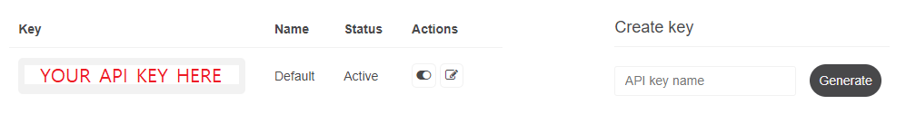
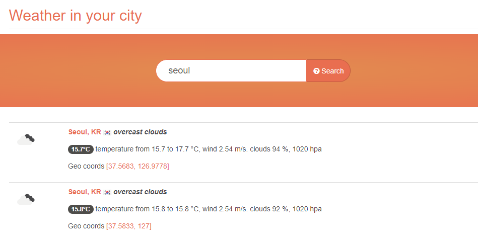

# Wallpaper Engine Live Weather

This project adds a new feature to the [Wallpaper Engine](https://www.wallpaperengine.io/): change wallpapers when it's sunny/rainy/snowy! This is done by a simple program which runs every hour to check current weather and sets corresponding **playlist**. Only supports Windows.

# How to Use

## Installation

To install, simply run `install.bat` file. (warning: DO NOT run as administrator!) This will install files in `C:\ProgramData\WallpaperEngineLiveWeather` and create a [Windows task](https://en.wikipedia.org/wiki/Windows_Task_Scheduler) scheduled to run the program every hour. To manually run the program, just execute `WallpaperEngineLiveWeather.exe`.

## Configuration

We will configure the program in 4 steps. First, open `C:\ProgramData\WallpaperEngineLiveWeather\config.json` file. This is the file where all configurations are written.

#### 1. API Key

**The most difficult step**: for the program to run properly, you have to generate a weather API key from [OpenWeatherMap](https://openweathermap.org).

Create an account in OpenWeatherMap, then go to [API keys](https://home.openweathermap.org/api_keys) section. Generate an API key, and write down the API key to `api_key` field in the configuration.



#### 2. City

Write down your country and city to the configuration. The name should appear if you search your city [here](https://openweathermap.org/find). For example, if you are living in Seoul, you should set configuration as:
```json
{
    "city": "Seoul",
    "country": "KR"
}
```



#### 3. (*optional*) Wallpaper Engine Directory

If Wallpaper Engine is installed in other than the default location, set `wallpaper_engine_bin` field to path of your Wallpaper Engine executable.

#### 4. (*optional*) Playlist Mapping

The program will set playlist by refering to `playlist_prefix` and `weather_bindings` field in the configuration. For example, in the configuration below:
```json
{
    "playlist_prefix": "weather_",
    "weather_bindings": {
        "Clear": "sunny",
        "Atmosphere": "sunny",
        "Clouds": "sunny",
        "Drizzle": "sunny",
        "Rain": "rainy",
        "Thunderstorm": "rainy",
        "Snow": "rainy",
        "Mist": "rainy"
    }
}
```
The program would set the playlist `weather_sunny` if the weather is `Clear`, `Atmosphere`, `Clouds`, or `Drizzle`. It would set the playlist `weather_rainy` if the weather is `Rain`, `Thunderstorm`, `Snow`, or `Mist`.

## Playlist

Playlists must be set in order to work properly. In Wallpaper Engine, **save** your playlist with the names (such as `weather_sunny`) you have configured earlier.


# Limitations

Due to the limited control in the [command line interface](https://help.wallpaperengine.io/en/functionality/cli.html#remove-wallpaper) of Wallpaper Engine, when the program checks the weather, the playlist will always advance to the next wallpaper. In other words, every hour, the playlist will be forcefully changed to the next wallpaper, indepedent of Playlist Settings in Wallpaper Engine.

For advanced users, if you want to change the check interval, edit the trigger of `WallpaperEngineLiveWeather` task in the Windows Task Scheduler.